# WhisperWave: Personalized Generation of ASMR Audio
We leverage AI-PC to enable personalized ASMR (autonomous sensory meridian response) audio program customization to be able to relieve brain fatigue and insomnia while protecting user privacy.

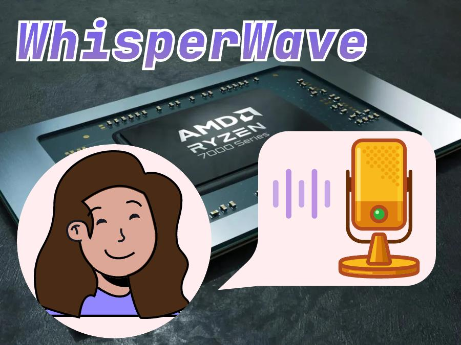

This is an implementation of the WaveNet architecture on [AMD Ryzen™ AI powered PCs](https://www.amd.com/en/products/processors/consumer/ryzen-ai.html).

## Introduction
People today often suffer from brain fatigue and insomnia due to excessive computer use [1]. ASMR, which stands for Autonomous Sensory Meridian Response, is a pleasant sensation triggered by auditory and visual stimuli that some people use to reduce stress. A program that automatically generates ASMR audio on a computer can help users take a breather between tasks, relieve the tension of daily life, or help them sleep better after a day of computer use. However, not everyone experiences ASMR audio in the same way. The same piece of audio can be pleasurable for some people and irritating for others. This is why it is important to personalize the experience. Our program should provide a wide variety of ASMR audio to suit different user preferences, while allowing users to customize their preferred ASMR elements.

Privacy is an issue that stems from the personalized experience. No one would want their private hobbies uploaded for corporate use without their knowledge. One of the great advantages of AI on the PC side is that there is no need to connect to the cloud, so there is no risk of privacy leakage. Our program will only touch the hobby information of the individual user on each PC side.

In this project, we aim to build an end-to-end audio generation model on an AMD Ryzen™ 9 7940HS Processor and its accompanying software, AMD Vitis™ AI, with the powerful PC provided by AMD. The processor of AI-PC can provide powerful arithmetic support and deliver high computing performance. The development software platform provides a developer-friendly environment for building AI solutions on the related AMD GPU hardware. It also supports standard frameworks such as PyTorch and TensorFlow, which is much more convenient for developers to deploy the model. 

<p align="center">
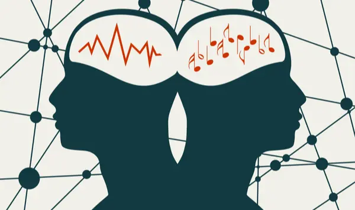
<div align="center">
Music can affect people's mood [1].
</div>
</p>

## Project Overview
Our project is developed as the figure shows:

<p align="center">
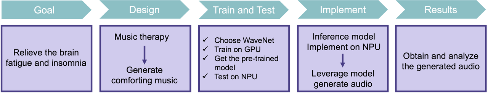
<div align="center">
The overview flow of our project.
</div>
</p>

The main goal of the project is to alleviate brain fatigue and insomnia through music therapy, so we chose to help users achieve better mental relaxation and sleep quality by generating comfortable music. To achieve this goal, we utilized the principles of music therapy and advanced artificial intelligence techniques, and we chose the WaveNet model, which can generate high-quality audio, as our base modeling framework. 
We first deployed the WaveNet model and trained it on the GPU to ensure efficient processing. After obtaining the pre-trained WaveNet model, we tested it with NPU to verify its performance in generating the desired soothing music. Once validation was complete, we deployed the pre-trained models from the GPU to the Ryzen™ AI platform for inference. This deployment allowed for real-time or near real-time generation of music, making it a useful tool for user applications. The resulting audio clips have soothing and comforting properties that can alleviate brain fatigue and insomnia.

The contribution can be summarized as follows:
- We propose WhisperWave method that utilizes AI model to generate comforting music based on user preferences. We propose an end-to-end full-process method. In this method, the advantage of WhisperWave is that it can be trained on the GPU to improve accuracy, but also do generation on the NPU to provide the music needed to relax the spirit and the mood, anytime it is needed on a personal PC.
- WhisperWave distinguishes itself by aiming to alleviate work-related stress and enhance mental well-being. Unlike traditional AI audio generation systems that mainly consider user preferences without considering the user's immediate mental or emotional state, WhisperWave recognizes the importance of addressing the stress posed by long-time PC usage. By honing in on the needs of this user group, WhisperWave provides effective stress relief and supports mental relaxation, setting it apart from generic AI audio solutions.
-  WhisperWave supports user personalization. Also, in order to protect user privacy, each PC-based AI has access to only one user's preference data.

## Demo
Users can listen to the music in the dataset, select some of their favorites, and record the corresponding numbers.

<p align="center">

<div align="center">
User listening to music in the dataset.
</div>
</p>

The user can then enter the indices corresponding to the audios into the program and the program will generate audio in a similar style.
<p align="center">
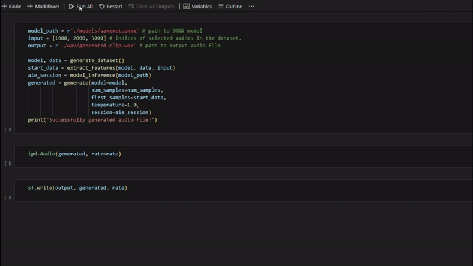
<div align="center">
Program generating audio.
</div>
</p>
In our code, you can run the following command line:

```
python WhisperWave.py --input <audio_indices>
                      --output <output_path>
                      --model_path <model_path>
```
Finally, the user can then hear the newly generated music!

<p align="center">

<div align="center">
User listening to the generated music.
</div>
</p>

## Environment Setup
### Step One: Enable the NPU
The method of enabling NPU comes from [2]. 
Open **Device Manager** in Windows. Under Device Manager, expand **System Devices** and look for **AMD IPU Device**.
<p align="center">
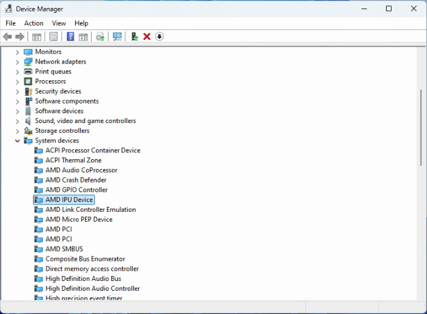
<div align="center">
Device manager in Windows.
</div>
</p>
If it does not appear in the list, then you will need to enable the device in the BIOS.  Open **Advanced Startup** in the System Settings menu, and click **Restart Now** under the **Recovery options**. The PC will reboot and you’ll enter the Advanced Startup page.

On the Advanced Startup page, first select **Troubleshoot**, then select **Advanced Options**, and finally select **UEFI Firmware Settings: Change settings in your PC’s UEFI firmware**. This will reboot your machine and bring you to the BIOS menu.

On the BIOS menu, select Advanced on the left bar, and then select **CPU Configuration**. Finally, set the **IPU** Control to "Enabled" if it is "Disabled". After that, you can save and restart your PC.
<p align="center">
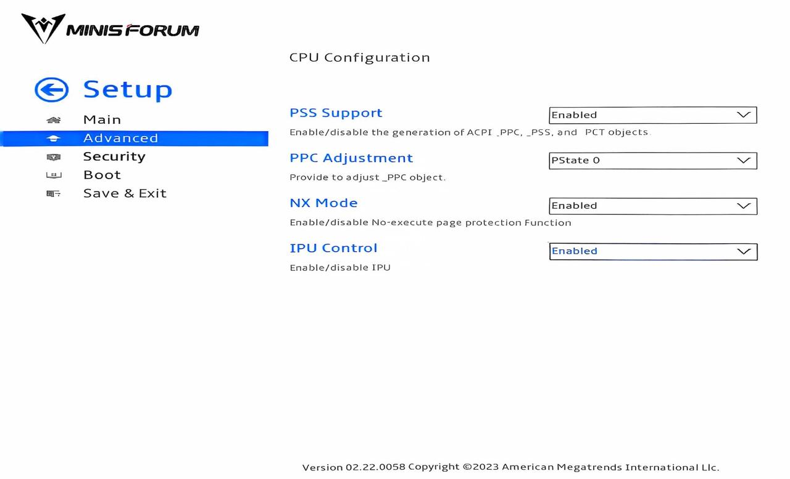
<div align="center">
Enable the IPU on the BIOS menu.
</div>
</p>
You can check the Device Manager again to see if NPU is successfully enabled.

### Step Two: Prepare the System
The tutorial is adapted from [3]. 

First, you have to install the NPU driver. Download the [NPU Driver](https://account.amd.com/en/forms/downloads/ryzen-ai-software-platform-xef.html?filename=ipu_stack_rel_silicon_prod_1.1.zip) and extract the file. Then, open a terminal in Administrator mode and run the bat file.
```
.\amd_install_kipudrv.bat
```
You can check the properties of **Device Manager -> System Devices -> AMD IPU Device** to see if the NPU driver has been successfully installed.
<p align="center">
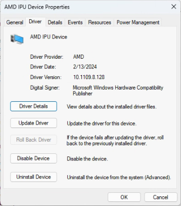
<div align="center">
AMD IPU Device driver.
</div>
</p>
You still have to install several software to enable the development and deployment of applications leveraging the NPU. The necessary software and corresponding version requirements are shown below.

| **Dependencies**        | **Version Requirement**  |
|-------------------------|----------------------|
| Visual Studio           | 2019                 |
| cmake                   | version >= 3.26      |
| python                  | version >= 3.9       |
| Anaconda or Miniconda   | Latest version       |


To install Visual Studio 2019, you can download it from [Visual Studio](https://my.visualstudio.com/downloads?q=Visual%20Studio%202019%20version%2016.11) site. In our project, we downloaded Visual Studio Community 2019 with version 16.11.35.
<p align="center">
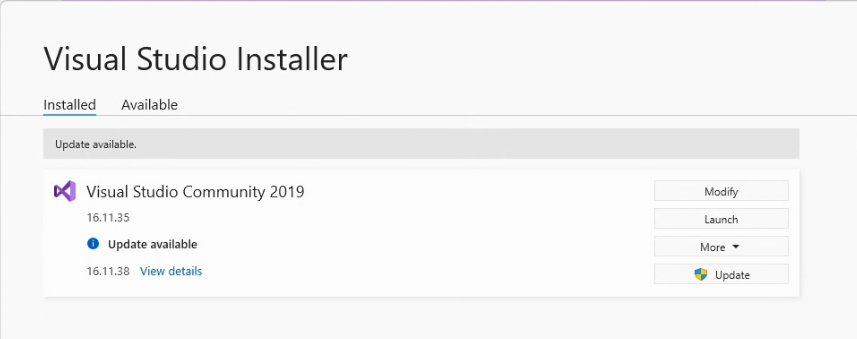
<div align="center">
Installed Visual Studio Community 2019.
</div>
</p>
To install cmake and python, we recommend installing cmake extension as well as python extension along with Visual Studio. You can click **Modify** in Visual Studio Installer and select the extensions you want to install. Once you've selected both, select Modify again and the additional tools will be installed.
<p align="center">
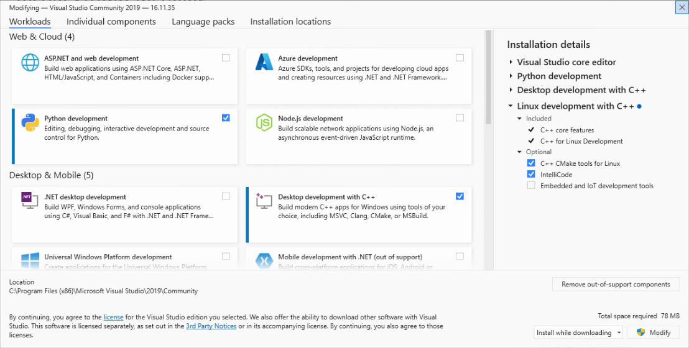
<div align="center">
Install cmake and python extensions with Visual Studio.
</div>
</p>
You can confirm that cmake and python were installed successfully by running the following command line.
 
```
cmake --version
python --version
``` 

To install the latest Miniconda, you can visit the [Miniconda](https://docs.anaconda.com/miniconda/) site. Or you can run the following command lines directly.
```
curl https://repo.anaconda.com/miniconda/Miniconda3-latest-Windows-x86_64.exe -o miniconda.exe
start /wait "" miniconda.exe /S
del miniconda.exe
```
You can check the version of your downloaded conda with the following command line.
```
conda --version
```
For convenience, we also recommend downloading [Visual Studio Code](https://code.visualstudio.com/), which is easy to install on Windows.

### Step Three: Install the Ryzen AI
The installation tutorial of Ryzen AI is still adapted from [3].

In order to make sure that when installing Ryzen AI software, the system can find all the previous software that you have installed, you need to set the Windows Path variable correctly. Search for **Environment Variables** in the System Properties, then select the Path variable, and then click **Edit**.
<p align="center">
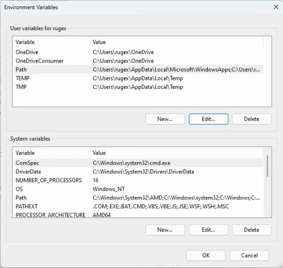
<div align="center">
Environment Variables in System Properties.
</div>
</p>
Miniconda requires the following paths to be added: `path\to\miniconda3\`, `path\to\miniconda3\Scripts\`, `path\to\miniconda3\Library\bin\` . CMake needs the following path to be added: `path\to\cmake\bin`. You can refer to our modified path below as a reference.
<p align="center">
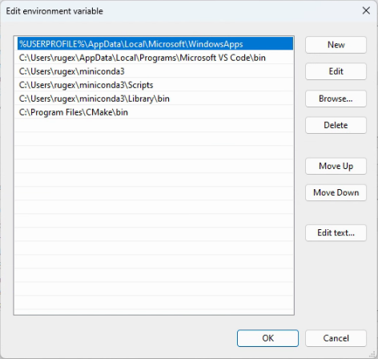
<div align="center">
The modified Path variable.
</div>
</p>
After that, you can download the Ryzen AI software [ryzen-ai-sw-1.1](https://account.amd.com/en/forms/downloads/ryzen-ai-software-platform-xef.html?filename=ryzen-ai-sw-1.1.zip/) and extract the file. Run the following command line to install the conda environment with specified environment name.
```
.\install.bat -env <env_name>
```
You can test whether you have successfully installed Ryzen AI with the test scripts under the `ryzen-ai-sw-1.1` package.

```
conda activate <env_name>
cd ryzen-ai-sw-1.1\quicktest
python quicktest.py
```
If you see `Test` passed, it means that you have successfully installed the Ryzen AI software.
```
[Vitis AI EP] No. of Operators :   CPU     2    IPU   398  99.50%
[Vitis AI EP] No. of Subgraphs :   CPU     1    IPU     1 Actually running on IPU     1
...
Test Passed
...
```
### Step Four: Install the Conda Environment
To get our program up and running, we need a few other packages. These are summarized in the `environment.yaml` file of our code, and you can install the environment in our project directory using the following command line.
```
git clone https://github.com/schrodinger95/amd-ai-pc-wavenet.git
cd amd-ai-pc-wavenet
conda env create -f environment.yaml --name <env_name>
conda activate <env_name>
```
## Methodology
### Step One: Create the Dataset
In order to train the model, we first need to create the dataset that will be used for training. We will explain this step-by-step below.

We first initialized some key parameters, including the audio sample rate, whether to convert to mono or not, and so on. These parameters help us control the generation and processing of the dataset. For creating dataset, we first get a list of all audio files in the specified directory. Then, load each audio file in turn and perform preprocessing on it, including sample rate conversion, mono conversion and normalization. After that, quantize the audio data and save the processed data to a file. During audio file processing, the audio file is first loaded using **Librosa** and sample rate conversion and mono conversion is performed as needed. If needed, the audio signal is also normalized. Then, the audio data is quantized using mu-law coding [4].

The final dataset we get consists of numpy arrays, where each data point consists of an input data and a label. The input data represents a fixed-length piece of audio in the shape `(num_classes, item_length)`, where `num_classes` is the number of tone types and item_length is the input length of the audio. Each line of the input data is the one-hot encoding corresponding to the tone at that position. Label is a small piece of audio in the shape `(1, target_length)`, representing a period of time in the future of the input data, where the length of the input data is the `target_length` and each point is the index corresponding to the tone. 

In our model training, we choose a set of graceful violin audio as our training dataset. Since the soft tones and melodies of the violin can bring about a deep sense of relaxation and help reduce stress and anxiety. Listening to soothing violin music in a tense or stressful environment can calm the mind and lower heart rate and blood pressure.

| **Dataset Parameter**   | **Value**            |
|-------------------------|----------------------|
| num_classes             | 256                  |
| item_length             | 3085                 |
| target_length           | 16                   |

### Step Two: Build the Model
For model selection, we choose CNN as our base framework. We use **WaveNet** [5] as our model and the model structure is shown below.

The input to WaveNet is a fixed length piece of continuous audio. The model recognizes `num_classes` of tones, and each data point in the input sequence is represented by the index corresponding to one of the classes. Based on the input sequence, which is also called the `receptive_field`, the model predicts future audio of the `output_length`. The `num_classes` of the model should be the same as that of the data set, and the relationship between the `receptive_field` and `output_length` and the data set parameters should be: `item_length = receptive_field + output_length - 1`, `target_length = output_length`.
<p align="center">
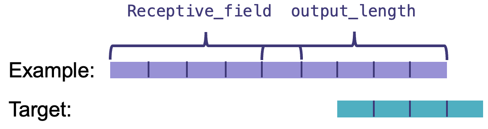
<div align="center">
Receptive field and output length of WaveNet.
</div>
</p>
The model architecture consists of an input layer, a one-dimensional convolutional layer, which is used to process the audio timing data. A residual module, which consists of multiple causal convolutional layers, each using extended convolution to capture long time dependencies. The output layer consists of a one-dimensional convolutional layer that converts the output of the residual module into the final audio signal.

For the parameter configuration of the model, we follow the model parameters in WaveNet, including its input data dimensions, the number of convolutional layers, the number of filters.  The structure of the model we use is shown in the following figure. The model consists of four modules in addition to `start_conv` and `end_conv`, which are `filter_conv` module, `gate_conv` module, `residual_conv` module, and `skip_conv` module. The `filter_conv` module, `gate_conv` module, and `residual_conv` module are all 32x32 input/output channels, and the `skip_conv` module is a 32x1024 input/output channel. In this model, we use the same gated activation unit as WaveNet [5].

$$
\mathbf{z} = \tanh \left( \mathbf{W}_{f,k} * \mathbf{x} \right) \odot \sigma \left( \mathbf{W}_{g,k} * \mathbf{x} \right)
$$

In this equation, where $*$ denotes a convolution operator, $\odot$ denotes an element-wise multiplication operator, $\sigma\left(·\right)$ is a sigmoid function, $k$ is the layer index, $f$ and $g$ denote filter and gate, respectively, and $k$ is a learnable convolution filter.

| **WaveNet Model Parameter** | **# number** |
| -------------------------|----------|
| layer                   | 10       |
| block                   | 3        |
| dilation_channel        | 32       |
| residual_channel        | 32       |
| skip_channel            | 1024     |
| end_channel             | 512      |
| receptive_field         | 3070     |
| output_length           | 16       |

<p align="center">
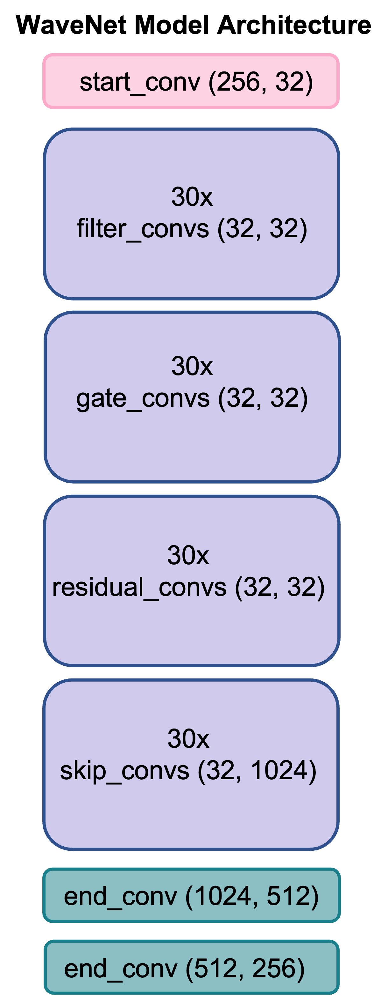
<div align="center">
WaveNet Model Architecture.
</div>
</p>
### Step Three: Train the Model
Due to the computing resource constraints of AI-PC, we loaded the model to CUDA for training in order to better train the model. We also modified the model for this purpose: including redirecting the model parameters, arithmetic positions of the dataset to cuda. Then, we focus on training the WaveNet model using the `WavenetTrainer` class. The training process is designed to optimize the model's performance on the provided dataset. Below are the key components and procedures involved in this process.

First, we need to initialize the `WavenetTrainer` class with several parameters, including the model, dataset, optimizer, learning rate, and other hyperparameters. The constructor sets up the optimizer, logger, and other necessary attributes for training. Then, before starting the training process, the dataset is loaded into a data loader. The data loader splits the dataset into small batches and provides these batches in random order during training to ensure the model generalizes well. After that, we will start the training loop. The training process involves multiple epochs, each of which iterates over the entire dataset. The steps within each epoch are as follows:
<p align="center">
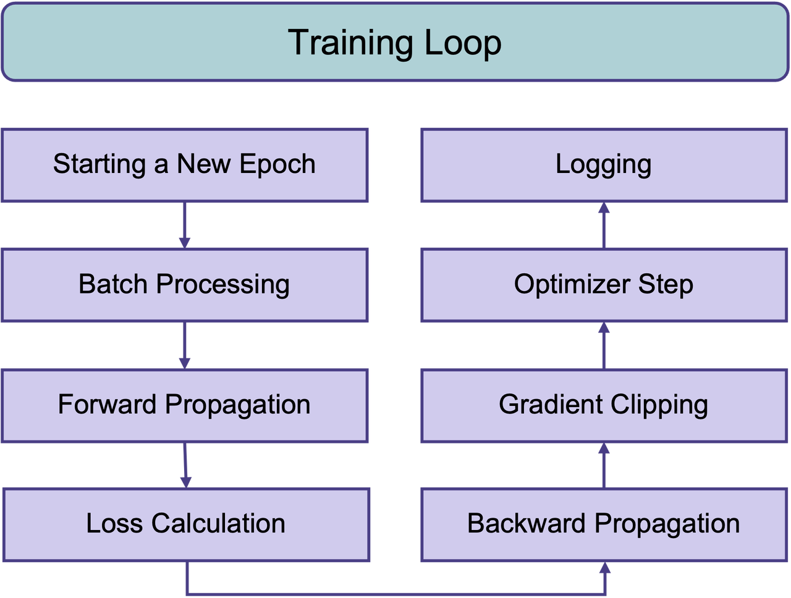
<div align="center">
The training loop in each epoch.
</div>
</p>

We trained the model on the pre-processed dataset with a learning rate of `0.001`, batch size is `16` and `10` epochs, and we observed that the model converged after 10 epochs without any further increase in accuracy. For learning rate, batch size, and loss, we iteratively train the model, and monitor the change of the loss function during the training process to prevent the model from underfitting or overfitting.

Through this step, we successfully train the WaveNet model and ensure its effectiveness on the dataset. Subsequent steps will focus on further features extraction.
### Step Four: Extract Features
Our ultimate goal is to create personalized audio. Specifically, in this project, we achieve this by enabling the model to generate a piece of similarly styled audio based on the audio selected by the user. Therefore, the model must be able to capture feature information from multiple audio files when generating the audio.

As described earlier, WaveNet generates audio files by receiving a piece of audio information as a receptive field, and predicting future audio based on that information. That is, it is the audio in the receptive field that influences the final audio generated by the model. Therefore, we decided to achieve the goal of extracting the features of the selected audio by intercepting a clip from each selected audio, and eventually letting these clips come together to form the input audio.
<p align="center">
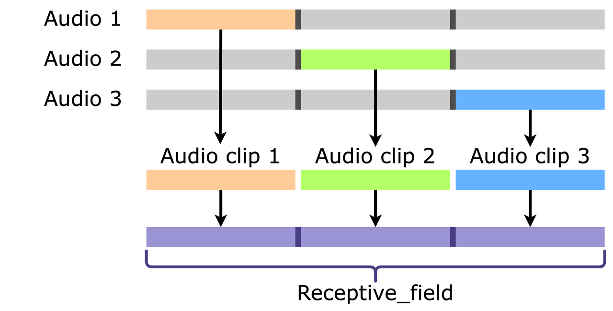
<div align="center">
Combine multiple audios into a receptive field.
</div>
</p>

In fact, given the principles of the generative model, audio clips located earlier in the receptive field will have less influence on the final generated audio, while audio clips located later in the receptive field will have more influence. However, since our goal is only to generate audio with a similar style to the selected multiple audio, this difference may not affect the final result we want to achieve.

### Step Five: Generate the Audio
Although WaveNet is built with a simple casual convolution layer and can only predict values at one point in time, we can continue to predict future audio by calling WaveNet multiple times.

Specifically, assuming receptive field length = $L$, at time $t$, the model runs with the values $x_{t-L}, x_{t-L+1}, ... , x_{t-1}$ in the past audio sequences, and computes $p(x_t|x_{t-L}, x_{t-L+1}, ... , x_{t-1})$ to predict the value of the future audio sequence $x_t$. Then, let $t = t+1$, and let the model predict the future audio sequence $x_{t+1}$ based on the values of $x_{t-L+1}, x_{t-L+2}, ...,x_t$. This is repeated until we get the desired result for the number of data points. Note that this model ensures causal ordering: the prediction $p(x_t|x_{t-L}, x_{t-L+1}, ... , x_{t-1})$ issued by the model at time step $$t$$ does not depend on any future time step $x_{t}, x_{t+1}, ... , x_T$.
<p align="center">
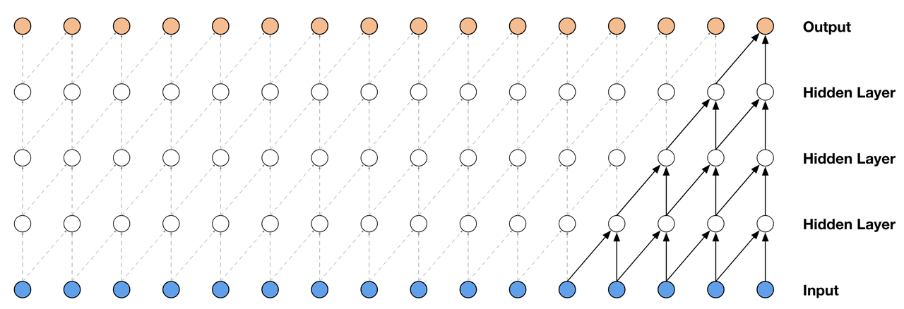
<div align="center">
Visualization of a stack of causal convolutional layers [5].
</div>
</p>
For more detailed generation principles, you can refer to the original WaveNet paper [5]. In summary, although we only have one WaveNet model, we can predict the audio in different time periods by calling it multiple times to achieve the final goal of generating a complete piece of audio.
<p align="center">
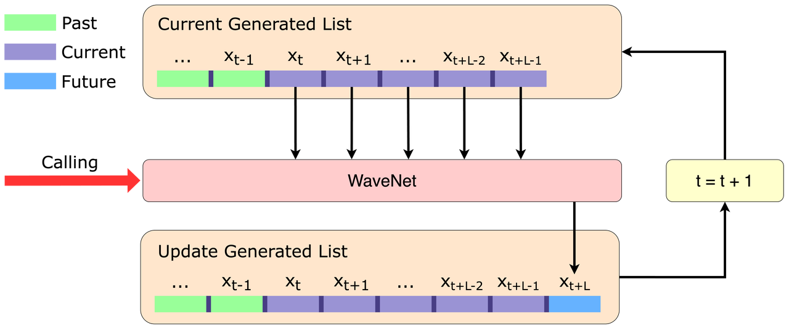
<div align="center">
Workflow for audio generation.
</div>
</p>
### Step Six: Deploy the Model
AMD Ryzen™ AI Software is a library of tools and runtimes for optimizing and deploying AI models on PCs. It enables models to run on a dedicated AI processing chip, the Neural Processing Unit (NPU). Developers can easily build and deploy models trained in PyTorch or TensorFlow, and then use the ONNX Runtime and Vitis AI Execution Provider to run them on an AI PC.
<p align="center">
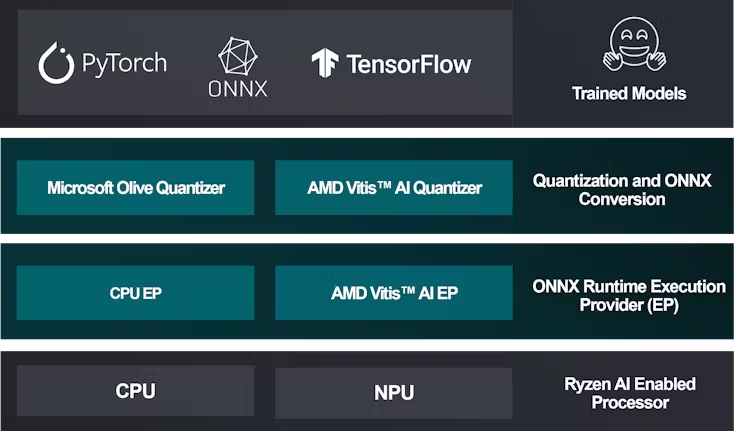
<div align="center">
Deployment workflow on Ryzen AI enabled PCs [2].
</div>
</p>
We need to deploy a WaveNet model and keep calling the deployed WaveNet model during the generation process to get multiple outputs that will eventually be combined into a complete audio clip. 

To do this, we first need a trained **PyTorch** model based on the previous steps. This model can be easily converted to ONNX format using PyTorch's built-in method. 

Then, if we want to quantize this model, we can use the **AMD Vistis AI** quantizer to achieve this goal. Quantization requires a calibration data set to help calibrate the quantized values, which can either be generated by sampling the training data set or randomly generated. It is also necessary to set quantization-related configurations, here we recommend using Unsigned Int8 to quantize the activation values and Signed Int8 to quantize the weights. The quantized model will also be saved in ONNX format.

Finally, use the **ONNX Runtime Vitis AI EP** to run the ONNX model, where we can choose to run the model on the CPU or NPU. Note that if you choose to run the model on the NPU, you will need additional time to compile the model for the first deployment.
<p align="center">
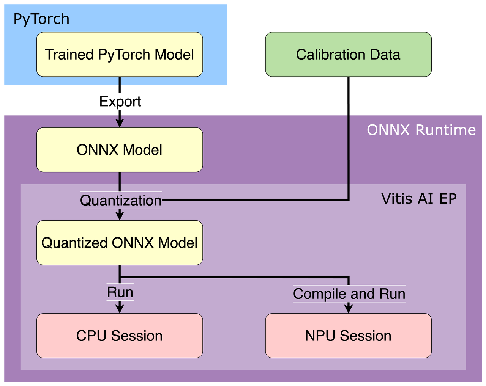
<div align="center">
Workflow of model deployment.
</div>
</p>
After we have successfully deployed the WaveNet model, we can now call the generate function. If we set `num_samples=160000` and `rate=16000`, then we can end up with a 10 second audio clip as shown below.
<p align="center">
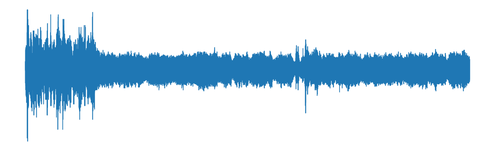
<div align="center">
Generated audio clip.
</div>
</p>
If you want to listen to the audio, we've posted two sample clips we generated here.

## Results
We analyzed and compared the time for the model to perform an inference and the average speed of sample generation when using different inference frameworks and inference sessions. The results are shown in the table below. It can be seen that **the most significant differences come from whether the PyTorch framework or the ONNX Runtime Vitis AI EP framework is used**. The inference speed of the ONNX Runtime Vitis AI EP framework is 1.51x to 1.59x that of the PyTorch framework, and the average sample generation speed is 1.32x to 1.33x. On the other hand, for models using the ONNX Runtime Vitis AI EP framework, the impact of **whether the model is deployed on the CPU or NPU is not significant**. The inference time when the model is deployed on the NPU is only 1.05x faster than when deployed on the CPU, and the average sample generation speed is almost the same.


### Runtime

The following runtime has been tested on **AMD Radeon 780M**.

|     **Session**    | **Inference (s)** | **Generation (sample/s)** |
|:------------------:|:-----------------:|:-------------------------:|
| PyTorch (CPU)      | 0.0954            | 0.0857                    |
| ONNX Runtime (CPU) | 0.0634            | 0.0649                    |
| ONNX Runtime (NPU) | 0.0601            | 0.0646                    |

We believe there are several reasons why the benefits of the NPU are not fully realized. First, **the model size of WaveNet itself is too small**, resulting in an already fast inference speed of the model, so there is little room for inference speed improvement. Second, **the operators used in the WaveNet model are not all supported by the NPU**, and some cannot be accelerated on the NPU. For example, the Conv1d operator used in WaveNet is not supported by Vitis AI. Third, in the process of generating audio, not all of the time overhead comes from model inference. There are **other data processing steps that consume a lot of time, and this part is not accelerated by the NPU**, resulting in the improvement brought by the model inference in the whole generation process almost negligible.

Therefore, if we want to further improve our project, the first thing to do is to rewrite the generation function. In the current generation function, each loop must wait for the model to do inference first, and then process the result of the reasoning before entering the next loop. We can try to do model inference and data processing in parallel and put them on NPU and CPU respectively; or try to put the data processing process on NPU as well. On the other hand, we can try to refer to the library of operators supported by Vitis AI to modify the structure of the WaveNet model, so that the operators used by the model can be better supported by the NPU.

## Conclusion
In this project, we deployed a modified WaveNet on an AMD AI-enabled PC and generated similar styles of ASMR audio based on preference data from a music database using either CPU or NPU processing power. We also compared the differences between using CPUs and NPUs to generate audio, and analyzed the reasons why the model does not perform significantly better on NPUs than on CPUs.

We believe that AI PCs are of great use in making AI technology easily and efficiently available to users. Currently, based on our experience with this project, AI PCs should be used more in scenarios where **smaller models are used** and that **model needs to be called many times**. And to further enhance the applicability of AI PCs, one possible improvement is to **refine the library of operators supported on the NPU** to increase the types of models that can be deployed.

## Reference
[1] Team, Tonara. “Benefits of Music Therapy.” Tonara, 25 May 2021, www.tonara.com/blog/benefits-of-music-therapy.

[2] Hackster.io. “AMD Pervasive AI Developer Contest PC AI Study Guide.” Hackster.io, www.hackster.io/512342/amd-pervasive-ai-developer-contest-pc-ai-study-guide-6b49d8.

[3] Installation Instructions — Ryzen AI Software 1.1 documentation. ryzenai.docs.amd.com/en/latest/inst.html.

[4] Vincentherrmann. “GitHub - Vincentherrmann/Pytorch-wavenet: An Implementation of WaveNet With Fast Generation.” GitHub, github.com/vincentherrmann/pytorch-wavenet.

[5] Van Den Oord, Aaron, et al. "Wavenet: A generative model for raw audio." arXiv preprint arXiv:1609.03499 12 (2016).

## Directory Files
```
| *.ipynb
| *.py
| environment.yaml
| vaip_config.json
|- snapshots
|- models
|- train_samples
|- wav
```
- [train_demo.ipynb](./train_demo.ipynb): Demo for model training. Recommended to run on machines with GPU. Modified from repository [pytorch-wavenet](https://github.com/vincentherrmann/pytorch-wavenet).
- [deployment_demo.ipynb](./deployment_demo.ipynb): Demo for running the model on an AI PC.
- [generation_demo.ipynb](./generation_demo.ipynb): Demo for generation of audio on an AI PC.
- [WhisperWave.py](./WhisperWave.py): Run WhisperWave for testing.
